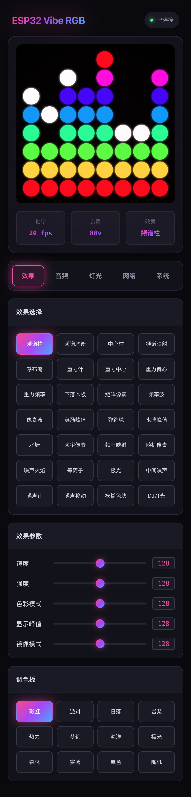

# ESP32-Vibe-RGB

基于 ESP32 的音频感应律动灯。通过 I2S 数字麦克风实时采集声音，经 FFT 频谱分析后在 WS2812B LED 矩阵上呈现 28 种音频可视化特效，并提供 WebSocket 网页控制面板。

---

## 功能特性

- **实时音频分析**：I2S 采集 + 512 点 FFT，输出 8 频带能量、节拍强度、主频检测
- **自动增益控制**：内置 AGC 算法，自动适应安静与嘈杂环境
- **28 种律动特效**：覆盖频谱、重力、粒子、噪声四大类别
- **Web 控制面板**：WebSocket 实时推送，支持特效切换、参数调节与配置保存
- **NVS 持久化**：所有参数掉电保存，重启后自动恢复

---

## 效果预览



---

## 硬件要求

| 组件 | 规格 |
| :--- | :--- |
| **主控** | ESP32 / ESP32-S3（推荐 240MHz，16MB Flash） |
| **麦克风** | I2S 数字麦克风（如 INMP441、MSM261S） |
| **LED 矩阵** | WS2812B（默认 8×8） |

### 默认 GPIO 接线

| 信号 | GPIO |
| :--- | :---: |
| LED Data | 16 |
| MIC SCK（时钟） | 5 |
| MIC WS（字选） | 4 |
| MIC DIN（数据） | 6 |

> 所有引脚均可在网页控制面板的「灯光」和「音频」页中修改，修改后需重启生效。

---

## 编译与烧录

项目基于 **ESP-IDF v5.0+**，组件依赖由 `idf_component.yml` 自动管理：

```bash
idf.py build
idf.py flash monitor
```

---

## 使用方法

### 首次配网

1. 设备首次上电后，LED 矩阵会显示蓝色扫列动画，表示进入配网模式
2. 手机或电脑连接 WiFi：`ESP32-Vibe-RGB`（无密码）
3. 连接后访问 `http://10.10.10.10` 进入配网页面，输入家庭 WiFi 的 SSID 和密码
4. 配网成功后设备自动重启并连接到家庭网络

### 日常控制

1. 查看路由器后台或串口日志获取设备 IP 地址
2. 浏览器访问该 IP 进入控制面板
3. 在面板中切换特效、调节亮度 / 速度 / 强度及色彩参数，点击「保存」后掉电不丢失

---

## 特效列表

| 类别 | 特效名称 |
| :--- | :--- |
| **经典频谱** | 频谱柱、频谱均衡、中心柱、频谱映射、瀑布流 |
| **重力流动** | 重力计、重力中心、重力偏心、重力频率、下落木板、矩阵像素 |
| **粒子波动** | 频率波、像素波、涟漪峰值、弹跳球、水塘峰值、水塘、频率像素、频率映射、随机像素 |
| **噪声抽象** | 噪声火焰、等离子、极光、中间噪声、噪声计、噪声移动、模糊色块、DJ 灯光 |

---

## 许可证

[MIT License](LICENSE)

---

## 参考项目

- [WLED](https://github.com/wled/WLED)
- [Sound-Reactive-WLED](https://github.com/athom-tech/Sound-Reactive-WLED)
